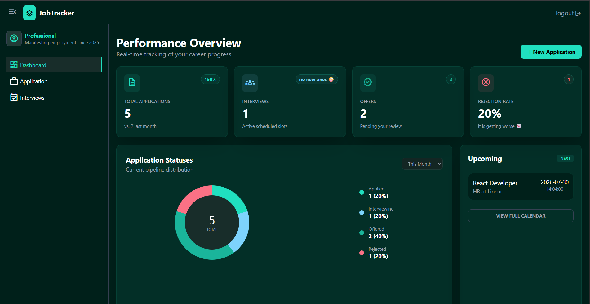

# JobTracker

A full-stack job application tracking app built to manage and monitor your entire job search pipeline — from application to offer.

🔗 **Live Demo:** [job-tracker-xi-ten.vercel.app](https://job-tracker-xi-ten.vercel.app)  
> Click **Demo Account** on the login page to explore without signing up.



---

## Features

- **Authentication** — Secure login and registration via Supabase Auth
- **Applications** — Full CRUD, status tracking, filtering by status, and detail view
- **Interviews** — Track upcoming and past interviews, edit and delete, grouped by date
- **Dashboard** — Real-time stats, donut chart with date filters, and upcoming interview preview
- **Realtime** — Live updates across all pages using Supabase Realtime

---

## Tech Stack

| Layer | Technology |
|---|---|
| Frontend | React + TypeScript + Vite |
| Styling | Tailwind CSS |
| Backend | Supabase (Auth, Database, Realtime) |
| Routing | React Router v6 |
| Deployment | Vercel |

---

## Running Locally

### Prerequisites
- Node.js 18+
- A Supabase project

### Setup

1. Clone the repository

```bash
git clone https://github.com/Amen974/job-tracker.git
cd job-tracker
```

2. Install dependencies

```bash
npm install
```

3. Create a `.env` file in the root

```env
VITE_SUPABASE_URL=your_supabase_url
VITE_SUPABASE_ANON_KEY=your_supabase_anon_key
```

4. Start the dev server

```bash
npm run dev
```

---

## Database Schema

**applications**
- `id`, `user_id`, `company`, `role`, `status`, `date_applied`, `job_url`, `notes`, `created_at`

**interviews**
- `id`, `application_id`, `user_id`, `interview_date`, `interview_time`, `type`, `notes`, `created_at`

---

## Author

Built by Amen — actively seeking a junior frontend role.